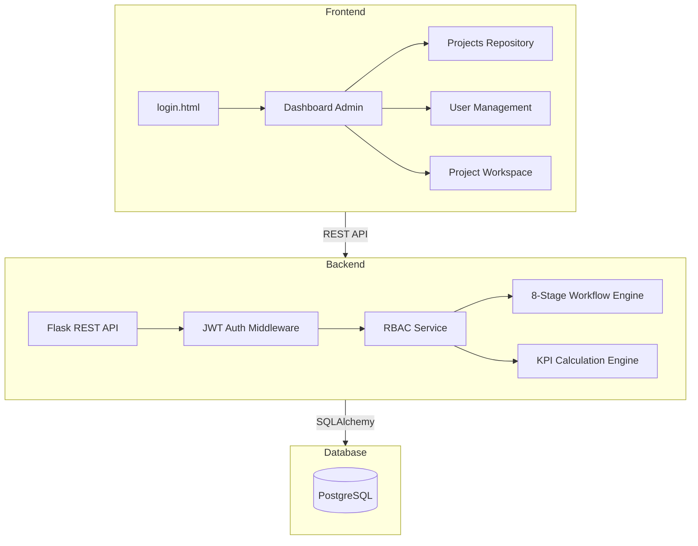

# QCMS – Quality & Continuous Improvement Management System

A high-performance, enterprise-grade SaaS platform designed for structured problem-solving (8D/Six Sigma) and continuous improvement within industrial and corporate environments.

---

## 🏗️ System Architecture



---

## 🌟 Core Modules & Features

### 1. 8-Stage Workflow Engine
A rigid, sequential problem-solving process that ensures data integrity and adherence to quality standards:
- **Stage 1: Problem Definition** (Problem statement, evidence)
- **Stage 2: Data Collection** (Baseline KPIs, raw data)
- **Stage 3: Root Cause Analysis** (Fishbone, 5-Why, Pareto)
- **Stage 4: Solution Planning** (ROI, resource planning)
- **Stage 5: Review & Approval** (Independent Reviewer sign-off)
- **Stage 6: Implementation** (Execution tracking)
- **Stage 7: Impact Verification** (Final KPI vs. Baseline)
- **Stage 8: Standardization** (SOP, lessons learned)

### 2. Enterprise RBAC System
Granular permissions for five distinct roles:
- **Admin**: Full system control, organization settings, user orchestration.
- **Reviewer**: Quality gatekeeper, approves/rejects project stage transitions.
- **Facilitator**: Methodological guide, validates RCA and Impact data.
- **Team Leader**: Project owner, manages team members and stage execution.
- **Team Member**: Contributor, updates task data and execution notes.

### 3. KPI & Analytics Engine
Real-time tracking of organizational performance:
- **Financial**: Total Cost Savings (Project-level & Org-level).
- **Operational**: Productivity Gains, Success Rate, Quality Index.
- **Safety**: Dedicated safety score tracking for industrial projects.

### 4. Interactive QC Tools
Built-in charting and data visualization using `Chart.js`:
- **Pareto Charts** for prioritizing issues.
- **Fishbone Diagrams** for root cause mapping.
- **Trend Lines** for KPI monitoring.

---

## 🛠️ Technology Stack

| Layer | Technologies |
| :--- | :--- |
| **Frontend** | Vanilla HTML5, CSS3 (Glassmorphism), ES6 JavaScript, Google Fonts |
| **Backend** | Python 3.10+, Flask, SQLAlchemy, JWT, Bcrypt |
| **Database** | PostgreSQL (Neon Serverless / Local Docker) |
| **DevOps** | Docker, Docker Compose, Nginx (In Production) |
| **Utilities** | Chart.js, Mermaid.js, jsPDF (Reporting) |

---

## 🚀 Rapid Deployment

### Docker Setup (Recommended)
The fastest way to get QCMS running locally:
```bash
# Clone the repository
git clone https://github.com/yourusername/qcms-v2.git
cd qcms-v2

# Start all services
docker-compose up --build
```
- **Login**: `http://localhost:80`
- **API**: `http://localhost:5000`
- **Default Credentials**: `admin` / `admin123`

### Manual Backend Setup
```bash
cd backend
pip install -r requirements.txt
python setup_db.py  # Initialize schema and seed roles
python run.py      # Start Flask development server
```

---

## 📄 Documentation Links
- [Frontend Developer Guide](frontend/README.md)
- [Backend API Guide](backend/README.md)
- [API Documentation](API_DOCUMENTATION.md)

---

Developed by **Antigravity** for Operational Excellence.
