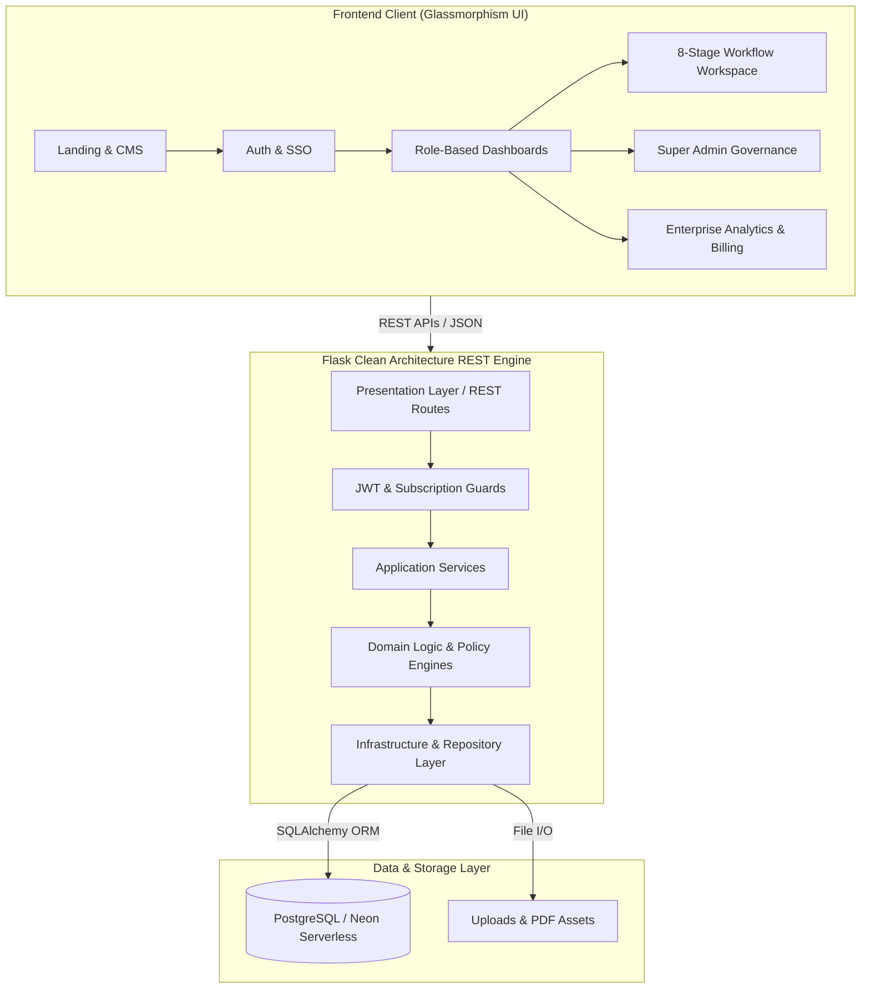

# QCMS Enterprise OS — Quality & Compliance Management System (IFQM)

An enterprise-grade, high-performance SaaS platform engineered for structured 8-stage problem solving (**Quality Circle / 8D / DMAIC / Six Sigma**), multi-tenant organization governance, automated compliance audit reporting, and real-time operational analytics.

---

## 🏗️ System Architecture


```mermaid
graph TD
    subgraph Client_Layer["Frontend Client (Glassmorphism UI)"]
        LP["Landing & CMS"] --> AUTH["Auth & SSO"]
        AUTH --> DASH["Role-Based Dashboards"]
        DASH --> WF["8-Stage Workflow Workspace"]
        DASH --> SA["Super Admin Governance"]
        DASH --> AN["Enterprise Analytics & Billing"]
    end

    subgraph API_Layer["Flask Clean Architecture REST Engine"]
        ROUTER["Presentation Layer / REST Routes"] --> MW["JWT & Subscription Guards"]
        MW --> APP["Application Services"]
        APP --> DOM["Domain Logic & Policy Engines"]
        DOM --> INFRA["Infrastructure & Repository Layer"]
    end

    subgraph Data_Storage_Layer["Data & Storage Layer"]
        DB[("PostgreSQL / Neon Serverless")]
        UPL["Uploads & PDF Assets"]
    end

    Client_Layer -- REST APIs / JSON --> API_Layer
    INFRA -- SQLAlchemy ORM --> DB
    INFRA -- File I/O --> UPL
```

---

## 📁 Repository Structure

The platform follows clean architecture principles with decoupled backend REST microservices and a responsive glassmorphic frontend:

```text
.
├── backend/                     # Decoupled Python/Flask REST API Service
│   ├── app/
│   │   ├── config/              # Environment configurations & secrets
│   │   ├── domain/              # Pure business entities, policies & feature engine
│   │   ├── application/         # Use-case handlers & domain interfaces
│   │   ├── infrastructure/      # Database models, ORM mappings & notification adapters
│   │   ├── presentation/        # REST route blueprints, JWT middleware & validators
│   │   └── utils/               # PDF fillers, report generators, i18n & avatar helpers
│   ├── run.py                   # Server entry point
│   ├── requirements.txt         # Dependency manifest
│   └── Dockerfile               # Backend container configuration
│
├── frontend/                    # Modern responsive web application client
│   ├── admin/                   # Super Admin portal, audit logs, settings & user management
│   ├── analytics/               # Enterprise KPI dashboards & financial reporting
│   ├── assets/                  # Design system CSS, i18n dictionaries & JS modules
│   │   ├── css/                 # Glassmorphic UI theme styles & utility tokens
│   │   ├── js/                  # Feature engines, stage renderers, analytics & settings
│   │   └── translations/        # Multilingual JSON dictionaries
│   ├── auth/                    # Login, registration, profile & password recovery
│   ├── dashboard/               # Role-tailored dashboards (Admin, CEO, Reviewer, Team Lead)
│   ├── projects/                # 8-Stage problem-solving workspace & standards repository
│   ├── index.html               # Public landing page & initial gatekeeper
│   ├── page.html                # CMS dynamic content renderer
│   ├── nginx.conf               # Nginx reverse proxy configuration
│   └── Dockerfile               # Frontend container configuration
│
└── docker-compose.yml           # Multi-container orchestration specification
```

---

## 🌟 Key Features & Capabilities

### 1. Structured 8-Stage Quality Circle Workflow
Rigid, sequential problem-solving lifecycle with automated stage-transition approval locks:
- **Stage 1: Problem Definition & Team Formation** (Problem statement, target metrics, team assignment)
- **Stage 2: Data Collection & Baseline** (KPI baselines, stratifications, evidence gathering)
- **Stage 3: Root Cause Analysis** (Interactive Fishbone diagram, 5-Why tree, Pareto analysis)
- **Stage 4: Solution Planning & Countermeasures** (Action items, cost-benefit analysis, ROI estimation)
- **Stage 5: Independent Review & Approval** (Gatekeeper sign-off by designated Reviewer/Facilitator)
- **Stage 6: Implementation & Execution** (Milestone tracking, task progress monitoring)
- **Stage 7: Impact & Savings Verification** (Post-execution KPI vs. baseline, tangible cost savings)
- **Stage 8: Standardization & SOP Integration** (Standard Operating Procedure updates, lessons learned)

### 2. Multi-Tenant Enterprise SaaS Governance
- **Organization Isolation**: Complete data segregation per organization.
- **Tiered Subscriptions**: Starter, Professional, Enterprise, and Custom tiers with automated feature-flag enforcement.
- **License & User Caps**: Real-time quota validation for active users, concurrent projects, and storage.
- **Payment & Upgrades**: Razorpay payment gateway integration for seamless plan upgrades and automated billing invoices.

### 3. Super Admin & Governance Portal
- **Centralized Management**: Manage all tenant organizations, subdomains, and administrator accounts.
- **Document Identity & Branding Engine**: Customize software name, acronym (`Software Short Name`), platform title, custom logo, legal company details, and invoice headers across the entire platform.
- **Compliance Activity Stream**: Real-time audit telemetry tracking user logins, state changes, security events, and risk levels with detailed drawer inspection.
- **Global Broadcast Engine**: Compose and dispatch announcements across organizations with audience targeting rules.

### 4. Automated PDF Report Generation
- Instant PDF generation for **QC Story Closure Summaries**, **Official Invoices**, **ISO 9001 Certificates**, and **Compliance Reports** via ReportLab and custom template fillers.

### 5. Multilingual Dynamic i18n Engine
- Real-time client-side translation into 6 languages (**English, Hindi, Kannada, Telugu, Tamil, Malayalam**).
- DOM MutationObservers automatically translate dynamically rendered tables, charts, and modal content.

---

## 🛠️ Technology Stack

| Layer | Technology |
| :--- | :--- |
| **Frontend UI** | HTML5, Vanilla JavaScript (ES6+), Vanilla CSS3 (Glassmorphism Design System) |
| **Icons & Visuals** | Lucide Icons, Chart.js (Data Visualization) |
| **Backend API** | Python 3.10+, Flask, SQLAlchemy ORM, Flask-JWT-Extended, Flask-Bcrypt |
| **PDF Engine** | ReportLab, PyPDF2 |
| **Database** | PostgreSQL (Neon Serverless / Local PostgreSQL) |
| **DevOps & Proxy** | Docker, Docker Compose, Nginx |

---

## 🚀 Quick Start & Deployment

### Prerequisites
- Python 3.10+
- Node.js (optional, for local static serving)
- Docker & Docker Compose (for containerized deployment)

### 1. Docker Setup (Recommended)
```bash
# Clone the repository
git clone https://github.com/harshith1432/imfq-QCMS.git
cd imfq-QCMS

# Build and launch services
docker-compose up --build -d
```
- **Web Application**: `http://localhost:80`
- **Backend REST API**: `http://localhost:5000`

### 2. Manual Backend Setup
```bash
# Navigate to backend directory
cd backend

# Create virtual environment
python -m venv venv
source venv/bin/activate  # On Windows: venv\Scripts\activate

# Install dependencies
pip install -r requirements.txt

# Start Flask development server
python run.py
```

---

## 📄 License & Attribution

Designed and engineered for enterprise quality governance, industrial compliance, and continuous improvement.

© 2026 **QCMS Enterprise OS**. All rights reserved.
