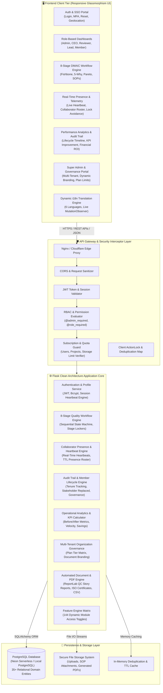

# QCMS Enterprise OS — Quality & Compliance Management System (IFQM)

An enterprise-grade, high-performance SaaS platform engineered for structured 8-stage problem solving (**Quality Circle / 8D / DMAIC / Six Sigma**), multi-tenant organization governance, real-time user presence & collaborator telemetry, automated compliance audit reporting, and advanced operational analytics.

---

## 🏗️ System Architecture


```mermaid
graph TD
    %% Client Tier
    subgraph Client_Layer["🖥️ Frontend Client Tier (Responsive Glassmorphism UI)"]
        UI_AUTH["Auth & SSO Portal<br/>(Login, MFA, Reset, Geolocation)"]
        UI_DASH["Role-Based Dashboards<br/>(Admin, CEO, Reviewer, Lead, Member)"]
        UI_WF["8-Stage DMAIC Workflow Engine<br/>(Fishbone, 5-Why, Pareto, SOPs)"]
        UI_PRES["Real-Time Presence & Telemetry<br/>(Live Heartbeat, Collaborator Roster, Lock Avoidance)"]
        UI_AN["Performance Analytics & Audit Trail<br/>(Lifecycle Timeline, KPI Improvement, Financial ROI)"]
        UI_SA["Super Admin & Governance Portal<br/>(Multi-Tenant, Dynamic Branding, Plan Limits)"]
        UI_I18N["Dynamic i18n Translation Engine<br/>(6 Languages, Live MutationObserver)"]
    end

    %% Gateway & Security Tier
    subgraph Gateway_Layer["🛡️ API Gateway & Security Interceptor Layer"]
        REV_PROXY["Nginx / Cloudflare Edge Proxy"]
        CORS_SEC["CORS & Request Sanitizer"]
        JWT_GUARD["JWT Token & Session Validator"]
        RBAC_GUARD["RBAC & Permission Evaluator<br/>(@admin_required, @role_required)"]
        QUOTA_GUARD["Subscription & Quota Guard<br/>(Users, Projects, Storage Limit Verifier)"]
        ACTION_LOCK["Client ActionLock & Deduplication Map"]
    end

    %% Application Core Services Tier
    subgraph Application_Layer["⚙️ Flask Clean Architecture Application Core"]
        AUTH_SRV["Authentication & Profile Service<br/>(JWT, Bcrypt, Session Heartbeat Engine)"]
        WF_SRV["8-Stage Quality Workflow Engine<br/>(Sequential State Machine, Stage Lockers)"]
        PRES_SRV["Collaborator Presence & Heartbeat Engine<br/>(Real-Time Heartbeats, TTL Presence Roster)"]
        AUDIT_SRV["Audit Trail & Member Lifecycle Engine<br/>(Tenure Tracking, Stakeholder Replaced, Governance)"]
        ANALYTICS_SRV["Operational Analytics & KPI Calculator<br/>(Before/After Metrics, Velocity, Savings)"]
        GOV_SRV["Multi-Tenant Organization Governance<br/>(Plan Tier Matrix, Document Branding)"]
        DOC_SRV["Automated Document & PDF Engine<br/>(ReportLab QC Story Reports, ISO Certificates, CSV)"]
        FEAT_SRV["Feature Engine Matrix<br/>(144 Dynamic Module Access Toggles)"]
    end

    %% Persistence & Data Tier
    subgraph Data_Layer["💾 Persistence & Storage Layer"]
        DB[("PostgreSQL Database<br/>(Neon Serverless / Local PostgreSQL)<br/>35+ Relational Domain Entities")]
        STORAGE["Secure File Storage System<br/>(Uploads, SOP Attachments, Generated PDFs)"]
        CACHE["In-Memory Deduplication & TTL Cache"]
    end

    %% Inter-Tier Connections
    Client_Layer -->|HTTPS / REST APIs / JSON| REV_PROXY
    REV_PROXY --> CORS_SEC
    CORS_SEC --> JWT_GUARD
    JWT_GUARD --> RBAC_GUARD
    RBAC_GUARD --> QUOTA_GUARD
    QUOTA_GUARD --> Application_Layer

    Application_Layer -->|SQLAlchemy ORM| DB
    Application_Layer -->|File I/O Streams| STORAGE
    Application_Layer -->|Memory Caching| CACHE
```

---

## 🏛️ Comprehensive Architecture & Subsystem Breakdown

### 1. Real-Time Presence & Collaborator Telemetry Engine
The platform includes an active presence and collision-avoidance architecture:
- **Client Heartbeat Dispatcher**: Active clients dispatch continuous background heartbeats (`/api/auth/heartbeat` and `/api/workflow/<project_id>/stage/<stage_id>/presence-heartbeat`) with browser GPS coordinates and timestamps.
- **Stage Concurrency & Lock Management**: Tracks who is currently viewing or actively modifying specific workflow stages, preventing accidental data overwrites and showing live collaborator badges.
- **Session Lifecycle & Invalidation**: Automatically revokes expired tokens and clears active sessions on idle timeouts or administrative terminations.

### 2. Structured 8-Stage Quality Circle (DMAIC / 8D) Workflow Engine
A sequential problem-solving state machine with automated approval gatekeepers:
- **Stage 1: Problem Definition & Team Formation**: Problem statement, 5W2H, initial KPI baselines, stakeholder assignment (Team Leader, Quality Facilitator, Project Reviewer, Team Members).
- **Stage 2: Current State & Baseline Data Collection**: KPI baseline measurements, stratification, SOP deviation analysis, and physical evidence capture.
- **Stage 3: Root Cause Analysis (RCA)**: Interactive visual **Ishikawa (Fishbone) diagram**, **5-Why analysis trees**, and **Pareto charts (80/20 rule)** with dynamic category weightage.
- **Stage 4: Solution Planning & Countermeasures**: Action planning, cost-benefit analysis, risk assessment, and financial ROI estimation.
- **Stage 5: Independent Review & Approval Gate**: Strict gatekeeper validation by designated Reviewer/Facilitator before implementation.
- **Stage 6: Implementation, Execution & Trial Testing**: Milestone tracking, task assignment matrices, and trial run evaluation.
- **Stage 7: Impact & Savings Verification**: Post-countermeasure vs. baseline KPI calculations, tangible and intangible financial savings computation.
- **Stage 8: Standardization, SOP Integration & Project Closure**: Standard Operating Procedure updates, institutional lessons learned, and final closure sign-offs.

### 3. Project Audit Trail & Member Lifecycle Tracking Engine
Complete forensic telemetry of all project-related activities:
- **Member Lifecycle Timeline**:
  - **Inception Roster**: Records all initial team members, leaders, facilitators, and reviewers.
  - **Mid-Project Joiners**: Captures when new members join during active stages with timestamps.
  - **Departures & Transitions**: Detects when members leave the project mid-way, calculating their exact joined date, departure date, total active tenure, and the actor who removed them.
  - **Stakeholder Handover**: Detects Facilitator replacements, Reviewer transitions, and Team Leader handovers (e.g. `in_project_facilitator` (Active: Aug 01 -> Aug 24) -> `Anita Das` (Active: Aug 24 -> Present)).
- **Human-Readable Formatter**: Parses JSON delta records into structured Before/After metric comparisons and chips without raw JSON formatting.
- **Governance Gate Logs**: Records every reviewer approval, rejection, and revision request along with timestamps and reviewer remarks.

### 4. Multi-Tenant SaaS & Subscription Quota Governance
- **Strict Tenant Isolation**: All database queries and storage buckets are strictly scoped by `org_id`.
- **Dynamic Plan Tiers**: Starter, Professional, Enterprise, and Custom tiers with automated license limit validation (Active Users, Active Projects, Storage Limits).
- **Document Identity & Custom Branding Engine**: Tenant organizations can configure custom platform titles, acronyms, company logos, and official invoice headers.
- **Broadcast & Announcement Engine**: Super Admins can dispatch global and targeted announcements with acknowledgment tracking.

### 5. Automated PDF & Export Generation Pipeline
- **QC Story Closure Reports**: Automated generation of comprehensive, publication-ready multi-page PDF summaries containing all 8 stages, charts, evidence photos, team rosters, and review signatures.
- **Bulk CSV / Excel Exporters**: High-speed export of organizational directories, project rosters, and audit logs with custom filter parameters.
- **ISO 9001 Compliance Certificates**: Instant certificate generation upon successful project closure.

### 6. Dynamic Multilingual i18n Engine
- **6 Supported Languages**: English, Hindi, Kannada, Telugu, Tamil, Malayalam.
- **Live DOM Mutation Observers**: Dynamically intercepts client rendering to translate tables, charts, navigation menus, and modal dialogs in real time.

---

## 📁 Repository Structure

```text
.
├── backend/                     # Decoupled Python/Flask REST API Service
│   ├── app/
│   │   ├── config/              # Environment configurations & secret management
│   │   ├── domain/              # Pure business entities, policies & subscription engine
│   │   │   ├── models/          # Entity definitions
│   │   │   └── services/        # Quota verification & domain rules
│   │   ├── application/         # Use-case handlers & business orchestrators
│   │   ├── infrastructure/      # Database models, ORM mappings & external mailers
│   │   │   └── database/        # SQLAlchemy schema (35+ domain models)
│   │   ├── presentation/        # REST route blueprints, JWT middleware & validators
│   │   │   ├── routes/          # Modular API endpoints (auth, project, analytics, admin, sop)
│   │   │   └── middleware/      # JWT authentication, role authorization & guards
│   │   └── utils/               # PDF fillers, report generators, i18n & avatar helpers
│   ├── run.py                   # Server WSGI entry point
│   ├── requirements.txt         # Dependency manifest
│   └── Dockerfile               # Backend container configuration
│
├── frontend/                    # Modern responsive web application client
│   ├── admin/                   # Super Admin portal, audit logs, settings & user management
│   ├── analytics/               # Enterprise KPI dashboards & financial reporting
│   ├── assets/                  # Design system CSS, i18n dictionaries & JS modules
│   │   ├── css/                 # Glassmorphic UI theme styles & utility tokens
│   │   ├── js/                  # Feature engines, stage renderers, analytics & API client
│   │   └── translations/        # Multilingual JSON dictionaries
│   ├── auth/                    # Login, registration, profile & password recovery
│   ├── dashboard/               # Role-tailored dashboards (Admin, CEO, Reviewer, Team Lead)
│   ├── projects/                # 8-Stage problem-solving workspace & standards repository
│   ├── index.html               # Public landing page & initial gatekeeper
│   ├── build.js                 # Frontend asset bundling, minification & cache-busting engine
│   ├── nginx.conf               # Nginx reverse proxy configuration
│   └── Dockerfile               # Frontend container configuration
│
└── docker-compose.yml           # Multi-container orchestration specification
```

---

## 🛠️ Technology Stack

| Layer | Technology & Frameworks |
| :--- | :--- |
| **Frontend UI** | HTML5, Vanilla JavaScript (ES6+), Vanilla CSS3 (Glassmorphism Design System), Bootstrap 5 Grid |
| **Icons & Charts** | Lucide Icons, Chart.js (Interactive Data Visualization) |
| **Backend API** | Python 3.10+, Flask, SQLAlchemy ORM, Flask-JWT-Extended, Flask-Bcrypt |
| **PDF & Reports** | ReportLab, PyPDF2, OpenPyXL, Pandas |
| **Database** | PostgreSQL (Neon Serverless / Local PostgreSQL) |
| **DevOps & Proxy** | Docker, Docker Compose, Nginx |

---

## 🚀 Quick Start & Local Setup

### 1. Docker Setup (Recommended)
```bash
# Clone the repository
git clone https://github.com/harshith1432/imfq-QCMS.git
cd imfq-QCMS

# Build and launch services
docker-compose up --build -d
```
- **Web Application**: `http://localhost:80`
- **Backend REST API**: `http://localhost:5000`

### 2. Manual Setup
```bash
# Backend Setup
cd backend
python -m venv venv
venv\Scriptsctivate          # On Linux/macOS: source venv/bin/activate
pip install -r requirements.txt
python run.py

# Frontend Build (Optional)
cd ../frontend
node build.js
```

---

## 📄 License & Attribution

Designed and engineered for enterprise quality governance, industrial compliance, and continuous operational excellence.

© 2026 **QCMS Enterprise OS**. All rights reserved.
