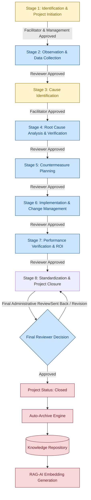

# 🔄 QCMS 8-Stage Quality Workflow & Data Dictionary

This document provides a comprehensive blueprint of the Quality & Continuous Improvement Management System (QCMS) structured problem-solving lifecycle. It outlines the sequence, data requirements, gatekeepers, and logic for each of the eight stages, concluding with the Knowledge Repository auto-archive mechanism.

---

## 🗺️ High-Level Stage Flow & Approvals

Below is the complete project lifecycle sequence showing submission paths, gatekeeper verification roles, and transitions.



---

## 🏛️ Gatekeeper Matrices & Decision Rules

| Stage | Stage Name | Mandatory Approver Role | Database Fields Updated | Next Stage Trigger Condition |
| :--- | :--- | :--- | :--- | :--- |
| **1** | Identification & Project Initiation | **Facilitator** & **Management** | `facilitator_approved`, `management_approved` | Both approvals set to `True` |
| **2** | Observation & Data Collection | **Reviewer** | `reviewer_approved`, `reviewer_id` | Reviewer approval set to `True` |
| **3** | Cause Identification | **Facilitator** | `facilitator_approved`, `facilitator_approver_id` | Facilitator approval set to `True` |
| **4** | Root Cause Analysis & Verification | **Reviewer** | `reviewer_approved`, `reviewer_id` | Reviewer approval set to `True` |
| **5** | Countermeasure Planning & Solution Development | **Reviewer** | `reviewer_approved`, `reviewer_id` | Reviewer approval set to `True` |
| **6** | Implementation & Change Management | **Reviewer** | `reviewer_approved`, `reviewer_id` | Reviewer approval set to `True` |
| **7** | Performance Verification & Benefits Realization | **Reviewer** | `reviewer_approved`, `reviewer_id` | Reviewer approval set to `True` |
| **8** | Standardization, Knowledge Sharing & Closure | **Reviewer** | `final_approval`, `final_approval_by` | Reviewer approves Stage 8 $\rightarrow$ Auto-Archives |

---

## 🔍 Stage-by-Stage Detailed Data Dictionary

### Stage 1: Problem Definition & Project Initiation
* **Core Purpose**: Plan the milestone schedule, build the cross-functional project team, capture baseline project attributes, and define the problem statement using the 5W2H methodology.
* **Gatekeeper**: **Facilitator & Management** (must approve before advancing to Stage 2).

#### Section 1: Project Team
* `circle_name` (Text): The name of the Quality Circle team.
* `work_area` (Text, Read-Only): Pre-populated from the project description.
* `sponsor` (Text, Read-Only): The executive sponsor of the project.
* `facilitator` (Text, Read-Only): Assigned methodological Facilitator.
* `team_leader` (Text, Read-Only): Assigned Team Leader.
* `duration` (Text, Read-Only): Automatically calculated project duration (days) based on start/end dates.
* `team_members` (JSON Array): List of active contributors.
  * Columns: `member` (User ID), `role` (Project Role), `designation` (Expertise/Title).

#### Section 2: Problem Background (5W2H)
* `what` (Textarea): What happened? (Detailed description of the issue).
* `where` (Textarea): Where did it happen? (Machine, plant, department, or customer site).
* `when` (Textarea): When did it happen? (Shift, date range, frequency).
* `who` (Textarea): Who is complaining/affected? (Internal operators, client, inspection team).
* `why` (Textarea): Why is the customer complaining? (Impact on standard operational performance).
* `how_discovered` (Textarea): How was it discovered? (Incoming audit, operator inspection, return logs).
* `how_big` (Textarea): How big is the problem? (Quantification of severity, e.g. PPM rate, cost loss).

#### Section 3: Current Performance
* `current_kpi` (Text): The primary performance KPI (e.g. Yield, OEE, PPM).
* `defect_rate` (Text): Baseline defect rate before team intervention.
* `complaint_count` (Number): Customer complaint count in the baseline period.
* `cost_impact` (Text): Approximate financial losses per month.
* `downtime` (Text): Process downtime caused by the issue.

#### Section 4: Justification
* `financial` (Textarea): Financial impact description.
* `customer` (Textarea): Customer experience / reputation impact.
* `quality` (Textarea): Quality compliance issues.
* `safety` (Textarea): Regulatory safety risks.
* `delivery` (Textarea): Impact on ship dates / cycle times.
* `regulatory` (Textarea): Compliance or environmental risks.
* `why_work_on_this` (Textarea): Summary argument on why the organization should prioritize this.

#### Section 5: Emergency Response / Containment
* `required` (Radio/Boolean): Is containment action required? (yes/no).
* `action` (Textarea): Description of containment (e.g., sort stocks, isolate batch, notify suppliers).
* `responsible` (Text): Person in charge of execution.
* `start_date` (Date): Containment start date.
* `completion_date` (Date): Containment target completion date.
* `status` (Select): Current status (Planned / In Progress / Completed).

#### Section 6: Theme, Target & Schedule
* `improvement_theme` (Text): Main theme (e.g. "Reduction of scrap rate in Line A").
* `current_level` (Text): Baseline level.
* `target_level` (Text): Desired target value.
* `expected_benefit` (Text): Quantitative target benefit.
* `expected_savings` (Text): Financial savings target.
* `milestones` (JSON Array): Scheduled stage-wise timelines.
  * Columns: `milestone` (Stage description), `planned_date` (Date), `status` (Planned / Completed).

---

### Stage 2: Observation & Data Collection
* **Core Purpose**: Walk the process (Gemba), verify existing standard compliance, collect baseline trend data, and stratify the data to pinpoint the defect concentration area.
* **Gatekeeper**: **Reviewer** (must approve before advancing to Stage 3).

#### Section 1: Process Observation
* `flow_version` (Text): Current version of the process flow map.
* `date` (Date): Observation walkthrough date.
* `observer` (Text): Walkthrough conductor.
* `area` (Text): Walkthrough location.
* `step` (Text): Walked process step.
* `notes` (Textarea): General observation notes.
* `finding_type` (Select): Type of finding (Bottleneck, Waste, Safety Risk, Defect, Deviation).
* `finding_severity` (Select): Severity (Low, Medium, High, Critical).
* `finding_desc` (Text): Specific finding summary.

#### Section 2: Standard Verification (SOP, Specification, Control Plan, PFMEA)
* Availabilities (`sop_avail`, `spec_avail`, `cp_avail`, `pfmea_avail`) (Checkbox): Are documents available?
* Followed (`sop_follow`, `spec_follow`, `cp_follow`) (Checkbox): Are processes followed?
* Deviated (`sop_dev`, `spec_dev`, `cp_dev`) (Checkbox): Are there deviations?
* Details (`sop_details`, `spec_details`, `cp_details`, `pfmea_details`) (Text): Details of audit results.
* PFMEA Reviewed (`pfmea_review`) (Checkbox): Was PFMEA reviewed?

#### Section 3: Data Collection Sources
* `sources` (JSON Array): Selected sources (Checksheet, Automated Logs, Audits, Customer Feedback, ERP System).
* `trend` (Textarea): Narrative trend analysis of the collected baseline data.

#### Section 4: Stratification
* Stratification Rows (JSON Array): Breakdowns to find concentration areas.
  * Columns: `type` (Shift, Machine, Operator, Material, Product, Customer, Department, Plant), `category` (Name/ID), `value` (Defect Count/Measure).

#### Section 5: Pareto Analysis
* Pareto Rows (JSON Array): Input list for Pareto generation.
  * Columns: `item` (Defect/Issue Name), `count` (Occurrences/Count).

#### Section 6: 5G Verification
* `gemba_notes` (Textarea): Observations at the actual place (Gemba).
* `gembutsu_item` (Text): Observations of the actual product/item (Gembutsu).
* `genjitsu_src` (Text): Source of the actual facts (Genjitsu).
* `genjitsu_facts` (Textarea): Captured objective data.
* `genri_prin` (Text): Underlying technical principles (Genri).
* `genri_status` (Select): Compliant / Non-Compliant.
* `gensoku_std` (Text): Operating standard / rule (Gensoku).
* `gensoku_status` (Select): Compliant / Non-Compliant.
* `gensoku_dev` (Textarea): Deviations from rules.

#### Section 7: Current State Evidence
* `metrics` (Textarea): Baseline metrics summary.
* `media` (File Uploads): Visual before-state photographs/videos.

---

### Stage 3: Cause Identification
* **Core Purpose**: Brainstorm all possible factors, build Level 1, 2, and 3 Fishbone Diagrams, filter and prioritize causes using a risk matrix, and verify the top causes.
* **Gatekeeper**: **Facilitator** (must approve before advancing to Stage 4).

#### Section 1: Brainstorming
* `session_name` (Text): Session identifier.
* `facilitator` (Text): Session moderator.
* `participants` (Text): Comma-separated list of attendees.
* `date` (Date): Brainstorming date.
* `notes` (Textarea): General notes or idea logs.

#### Section 2: Fishbone Diagram (L1 & L2 Causes)
* Fishbone Rows (JSON Array): Multi-level cause mappings.
  * Columns: `category` (Man, Machine, Method, Material, Measurement, Environment), `level1` (Primary Cause), `level2` (Sub-Cause), `status` (Selected / Rejected).

#### Section 3: Cause Register
* Cause Rows (JSON Array): Central register of all brainstormed ideas.
  * Columns: `id` (Cause ID), `category` (Area), `description` (Cause), `origin` (Machine/Process Step).

#### Section 4: Cause Prioritization
* Prioritization Rows (JSON Array): Risk priority calculation.
  * Columns: `cause` (Description), `impact` (Score 1-10), `frequency` (Score 1-10), `control` (Score 1-10), `total` (Computed: Impact $\times$ Frequency $\times$ Control).

#### Section 5: Cause Verification Log
* Verification Rows (JSON Array): Verification test details.
  * Columns: `cause` (Description), `method` (Inspection/Trial), `source` (Data Collected), `result` (Observation), `conclusion` (Verified Root Cause / Disproven).

#### Section 6: Level 3 Fishbone Summary
* `summary` (Textarea): Summary of the primary technical causes selected for Stage 4 deep-dive.

---

### Stage 4: Root Cause Analysis & Verification
* **Core Purpose**: Statistically validate causes using hypothesis testing, perform Good vs. Bad comparisons, formulate 5-Why chains to find systemic failures, and prioritize the root causes.
* **Gatekeeper**: **Reviewer** (must approve before advancing to Stage 5).

#### Section 1: Verified Causes List
* Verified Causes (JSON Array):
  * Columns: `cause` (Name), `method` (Verification check), `status` (Verified / Unverified).

#### Section 2: Hypothesis Testing
* Hypothesis Rows (JSON Array): Structural hypothesis setups.
  * Columns: `hypothesis` (Description), `null_hyp` ($H_0$), `alt_hyp` ($H_1$), `test_used` (t-Test, ANOVA, Chi-Sq, etc.).

#### Section 3: Good vs. Bad Comparison
* Comparison Rows (JSON Array): Parameter check between normal and defective conditions.
  * Columns: `factor` (Parameter), `good_condition` (Spec/Value), `bad_condition` (Spec/Value), `difference` (Key Delta).

#### Section 4: Statistical Validation
* Validation Rows (JSON Array): Statistical findings.
  * Columns: `test_type` (Statistical Test), `p_value` (P-Value result), `confidence_level` (95%, 99%), `conclusion` (Reject/Accept $H_0$).

#### Section 5: Data Reconfirmation
* Reconfirmation Rows (JSON Array): Repeat trial verifications.
  * Columns: `data_set` (Lot/Batch ID), `sample_size` (n), `result` (PPM / Defect count), `validated` (Yes/No).

#### Section 6: Why-Why (5-Why) Analysis
* Why-Why Rows (JSON Array): Systemic drill-down.
  * Columns: `cause` (Problem/Direct Cause), `why1` (Level 1 Why), `why2` (Level 2 Why), `why3` (Level 3 Why), `why4` (Level 4 Why), `why5` (Level 5 Root Cause).

#### Section 7: Root Cause Register
* Root Cause Rows (JSON Array): Verified root causes.
  * Columns: `id` (RC ID), `root_cause` (Description), `source` (RCA/5-Why link).

#### Section 8: Root Cause Ranking
* Ranking Rows (JSON Array): Scoring matrix.
  * Columns: `root_cause` (Description), `impact` (1-10), `ease_of_fix` (1-10), `score` (Computed: Impact $\times$ Ease).

---

### Stage 5: Countermeasure Planning & Solution Development
* **Core Purpose**: Brainstorm potential solutions for each ranked root cause, score solutions based on feasibility/effectiveness, conduct cost-benefit analyses, and draft the 3W1H execution plan.
* **Gatekeeper**: **Reviewer** (must approve before advancing to Stage 6).

#### Section 1: Root Cause Mapping
* Mapping Rows (JSON Array): Solutions linked to verified root causes.
  * Columns: `root_cause` (RC ID), `proposed_solution` (Solution title).

#### Section 2: Solution Brainstorming
* Brainstorming Rows (JSON Array):
  * Columns: `idea` (Proposed solution), `contributor` (Name), `feasibility` (High/Med/Low).

#### Section 3: Solution Evaluation Matrix
* Evaluation Rows (JSON Array): Feasibility scoring.
  * Columns: `solution` (Title), `effectiveness` (1-10), `cost` (1-10), `feasibility` (1-10), `time` (1-10), `total_score` (Computed: Effectiveness $+$ Cost $+$ Feasibility $+$ Time).

#### Section 4: Cost-Benefit Analysis (CBA)
* CBA Rows (JSON Array):
  * Columns: `solution` (Title), `estimated_cost` (Currency), `expected_benefit` (KPI shift description), `roi` (Expected ROI %).

#### Section 5: Side-Effect / Risk Analysis
* Side-Effect Rows (JSON Array): Failure Mode & Effects Mitigation.
  * Columns: `solution` (Title), `potential_risk` (Negative side effect), `mitigation_plan` (Risk action).

#### Section 6: Pilot Verification
* Pilot Rows (JSON Array): Small-scale trial results.
  * Columns: `solution` (Title), `location` (Test site), `duration` (Days/Runs), `result` (Outcome), `decision` (Adopt / Scale Up / Abandonded).

#### Section 7: Action Plan (3W1H)
* Action Rows (JSON Array): Target deployment steps.
  * Columns: `what` (Action Step), `who` (Owner), `when` (Target Date), `how` (Method/Procedure).

#### Section 8: Resource Planning
* Resource Rows (JSON Array): Budget & materials requested.
  * Columns: `resource` (Item), `budget` (Value), `source` (Internal/Vendor), `status` (Requested / Approved / Procured).

---

### Stage 6: Implementation & Change Management
* **Core Purpose**: Track implementation tasks, monitor budget execution, ensure documentation updates (SOPs, FMEAs), log training attendance, and track readiness reviews.
* **Gatekeeper**: **Reviewer** (must approve before advancing to Stage 7).

#### Section 1: Implementation Execution Plan
* Execution Rows (JSON Array):
  * Columns: `action` (Implementation step), `owner` (Name), `start_date` (Date), `end_date` (Date), `status` (Planned / Active / Completed).

#### Section 2: Task Management
* Task Rows (JSON Array): Kanban-like subtask tracking.
  * Columns: `task` (Details), `assignee` (Name), `due_date` (Date), `completion_pct` (%).

#### Section 3: Resource Deployment
* Resource Rows (JSON Array): Financial check.
  * Columns: `resource` (Item), `planned_cost` (Budget), `actual_cost` (Actual spend), `variance` (Computed: Planned $-$ Actual).

#### Section 4: Change Management SOPs
* Change Rows (JSON Array): Process control updates.
  * Columns: `change_description` (SOP modification), `sop_updated` (Y/N), `date` (Date).

#### Section 5: Risk & Resistance Management
* Risk Rows (JSON Array): Human resource / production friction logs.
  * Columns: `anticipated_risk` (Resistance area), `strategy_executed` (Mitigation), `status` (Resolved / Active).

#### Section 6: Training & Awareness
* Training Rows (JSON Array): Competency updates.
  * Columns: `target_group` (Department/Shift), `training_module` (SOP name), `date` (Date), `attendance_pct` (%).

#### Section 7: Stakeholder Communication Log
* Communication Rows (JSON Array):
  * Columns: `stakeholder` (Role/Group), `message` (Info sent), `date` (Date), `channel` (Email, Townhall, Training).

#### Section 8: Implementation Evidence
* Evidence Rows (JSON Array): Physical proof logs.
  * Columns: `document_name` (Attachment description), `link` (Upload storage path), `uploaded_by` (Name).

#### Section 9: Readiness Verification
* Readiness Rows (JSON Array): Pre-production checks.
  * Columns: `item` (Check list), `verified_by` (Inspector), `status` (Ready / Pending).

---

### Stage 7: Performance Verification & Benefits Realization
* **Core Purpose**: Validate post-implementation KPIs, conduct statistical checks (Before vs. After), compile ROI statements, perform audits, and review lessons implemented.
* **Gatekeeper**: **Reviewer** (must approve before advancing to Stage 8).

#### Section 1: KPI Verification
* KPI Rows (JSON Array):
  * Columns: `metric` (KPI Name), `baseline` (Initial value), `target` (Target value), `actual` (Measured post-value), `variance` (Computed: Actual $-$ Target).

#### Section 2: Before vs. After
* Before/After Rows (JSON Array): Visual/Process comparison.
  * Columns: `metric` (Parameter), `before_condition` (Text/Value), `after_condition` (Text/Value), `improvement_pct` (%).

#### Section 3: Statistical Validation
* Validation Rows (JSON Array): Statistical proof.
  * Columns: `test_type` (t-Test, ANOVA), `p_value` (Calculated), `conclusion` (Status shift proved).

#### Section 4: Benefit Realization
* Benefit Rows (JSON Array): Broad organizational metrics.
  * Columns: `benefit_category` (Safety, Quality, Cost, Delivery), `expected` (Value), `actual` (Value), `variance` (Computed: Actual $-$ Expected).

#### Section 5: ROI Validation
* `total_investment` (Number): Sum of all project costs (Stage 5 resources + Stage 6 execution).
* `annual_savings` (Number): Extrapolated annual cost savings.
* `payback_period` (Text, Read-Only): Calculated payback period (Years) = $\text{Investment} \div \text{Savings}$.
* `roi_pct` (Text, Read-Only): Calculated ROI % = $((\text{Savings} - \text{Investment}) \div \text{Investment}) \times 100$.

#### Section 6: Sustainability Check
* Sustainability Rows (JSON Array): Periodic process audit checks.
  * Columns: `check_item` (Control standard), `auditor` (Inspector), `result` (Pass/Fail), `action_required` (Remediation).

#### Section 7: Side Effect Verification
* Side Effect Rows (JSON Array): Check if upstream/downstream areas were harmed.
  * Columns: `process_area` (Area name), `negative_impact` (Observed issues), `details` (Notes).

#### Section 8: Lessons Implementation
* Lessons Rows (JSON Array):
  * Columns: `category` (Process/Tool), `lesson` (Captured wisdom), `actionable_insight` (Rules for future designs).

---

### Stage 8: Standardization, Knowledge Sharing & Closure
* **Core Purpose**: Audit documentation releases, plan horizontal deployments to other lines/plants, compile final team recognitions, and submit the project for official administrative closure.
* **Gatekeeper**: **Reviewer** (Final administrative approval $\rightarrow$ Triggers auto-archive).

#### Section 1: Standardization Document Release
* Standardization Rows (JSON Array):
  * Columns: `document` (SOP/Work Instruction ID), `previous_version` (vOld), `new_version` (vNew), `update_date` (Date).

#### Section 2: Training & Adoption
* Training Rows (JSON Array): Core competency checks.
  * Columns: `target_group` (Plant operators), `training_date` (Date), `attendance_pct` (%), `adoption_status` (Fully Adopted / In Training).

#### Section 3: Horizontal Deployment
* Horizontal Rows (JSON Array): Replicating the solution across other lines or sister sites.
  * Columns: `area` (Target line/site), `target_date` (Date), `status` (Planned / Completed), `owner` (Name).

#### Section 4: Lessons Learned Register
* Lessons Rows (JSON Array):
  * Columns: `category` (Design/Material/Process), `lesson` (Observed issue), `future_recommendation` (Avoidance actions).

#### Section 5: Benefits Summary
* Benefits Rows (JSON Array):
  * Columns: `metric` (KPI Name), `baseline` (Stage 1), `final` (Stage 7), `total_savings` (Value).

#### Section 6: Remaining Opportunities
* Opportunities Rows (JSON Array): Problems not resolved by this cycle.
  * Columns: `identified_problem` (Description), `priority` (High/Med/Low), `next_steps` (New QC project proposed).

#### Section 7: Knowledge Repository Mapping
* Repository Rows (JSON Array):
  * Columns: `keyword` (Tags), `summary` (Case Study Abstract), `link` (Closure slide/deck path).

#### Section 8: Team Recognition
* Recognition Rows (JSON Array):
  * Columns: `member` (User), `contribution` (Specific task), `award` (Certification/Appreciation details).

#### Section 9: Project Closure Metadata
* `project_id` (Text, Read-Only): Unique system-generated ID.
* `start_date` (Date): Actual launch date.
* `end_date` (Date): Actual closure date (today's date).
* `final_status` (Select): Closed-Successful / Closed-Partial / Suspended.
* `handover_to` (Text): Operations owner accepting long-term control.

---

## 💾 Auto-Archive Engine & RAG-AI Integration

Once a Reviewer approves a project at **Stage 8**, the backend intercepts the event and executes the **Auto-Archive Engine** (implemented in `repository_routes.py` $\rightarrow$ `auto_archive_project_to_repository`):

### 1. Data Aggregation
The engine queries the project's workflow state and extracts critical data across different stages:
* **Problem Summary**: Extracted from Stage 1 Theme (`theme_target_schedule.improvement_theme`) with a fallback to the 5W2H What field (`background_5w2h.what`).
* **Root Causes**: Formulated by concatenating the verified root cause list from Stage 4 (`root_cause_register`).
* **Solution Summary**: Aggregated from Stage 5 Countermeasure Mapping (`root_cause_mapping`).
* **KPI Improvement & Savings**: Extracted from Stage 7 `roi_validation` (`roi_pct` and `annual_savings`).
* **Standardization Details**: Extracted from Stage 8 SOP link (`standardization[0].link`) and closure report path (`knowledge_repository[0].link`).

### 2. Knowledge Repository Entry Creation
The gathered parameters are saved in a permanent `KnowledgeRepository` record.

### 3. RAG Vector Ingestion
The engine builds an ingestion context document:
```text
Title: [Project Title]
Category: [Project Category]
Problem: [Problem Summary]
Root Cause: [Root Causes]
Solution: [Solution Summary]
Keywords: [Project Title + Category]
```
This text is sent to the local embedding model (`SentenceTransformer`), converted into a vector embedding array, and saved in the PostgreSQL database. This allows any user in the organization to use the **RAG-AI Search Bar** to retrieve this project's complete historical solution when solving similar issues.
